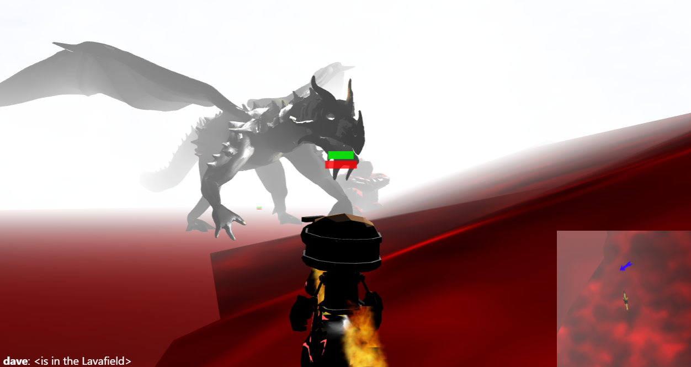
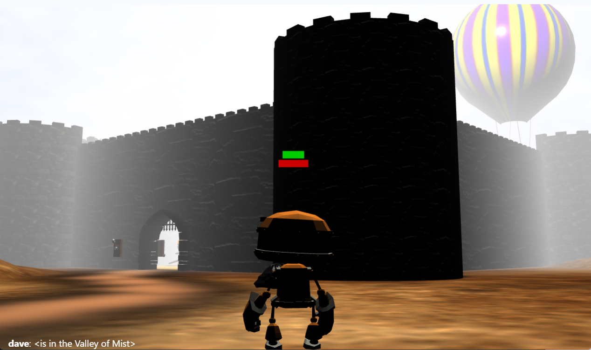
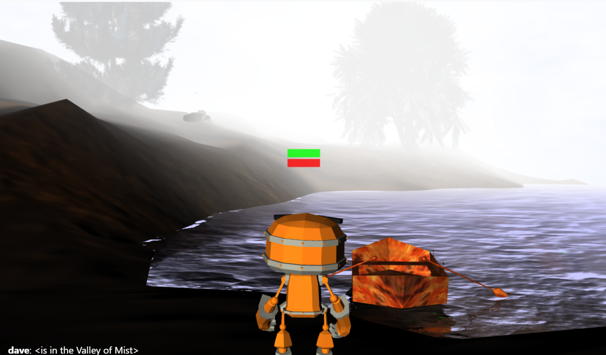
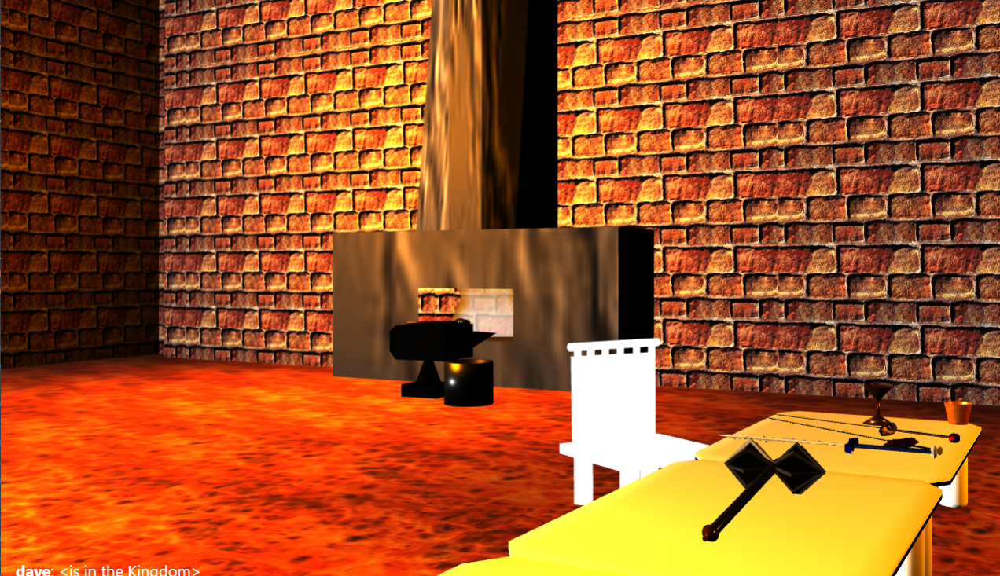

## 3D Virtual Life
#### Copyright Dave Norton 2022
#### Testing framework (Chai/Mocha) from FCC, though not used much
#### pointerLockControls concept from mrdoob & Mugen87







###Controls:
*mouse movement* - visual field
*scroll wheel* - adjust zoom

*left/right mouse buttons*
Talk with friendlies
Use or activate the selected object (like switches)

*Only when in attack range*
left/right attack (hold shift for kick attacks if the model supports)

*middle mouse button* - launch/throw/toss item equipped in hand 
(e.g. planting sunseeds, watering from watercan, or firing arrows with bow equipped)

*arrow keys* - movement
*space bar* - jump
*i* - inventory (use the toggle to view spells; both allow multiple pages)
*h* - hotkey sidebar (shows the items/spells that have been equipped to hotkeys)
*1-8* - hotkeys; use the item/spell for each mapped key
*m* - mini-map
*alt-t* - toggle chat 

##Things to beginners to try:
* Talk and trade with friendlies
* Attack beasts at close range (or launch arrows)
* Pick up the key and open the hatch to the dungeon
* Go rafting on the lake by mounting the fishing boat
* Gain enough money to buy the fishing pole and go fishing at the lake
* Take the elevator up and see the sights by mounting the hot-air balloon
* Plant a sunseed, fill the watering can at a water source, and water the seed
* Use sunfruit to feed a horse and gain his loyalty for a while
* If you find some ore on the ground, it's probably a good place to mine for more...
* Can you find the swamp or the lava field?

This production version assumes MongoDB is up and running on port 27017 
and uses the DB called "nortonAdventure" (wiredtiger) by default.

Unzip cdn.zip, png.zip, and 3d.zip in their respective directories for stock libraries/graphics.
You may need to rename some graphics to lowercase the extensions, etc.  I'm too lazy to go re-zip
this massive file or change the references.  I was running on Windows before (case-insensitive)
and found I had to do some mass-renaming on Ubuntu.  Just watch F12/devtools in the browser to
see which files are causing trouble.  Here's a quick way to mass-lowercase the extensions:

```
find . -name '*.*' -exec sh -c '
  a=$(echo "$0" | sed -r "s/([^.]*)\$/\L\1/");
  [ "$a" != "$0" ] && mv "$0" "$a" ' {} \;
```

Also change the references to localhost to your own public IP address for socket handling
(unless you only want to play locally).

Thanks to the graphics team: Mike Tidwell, Chris Lobato, Rodney Thinn, and Steve Leavitt.

-----

# Only applicable for auto-startup with pm2:
To configure auto-startup for pm2.exe service with pm2-windows-service module:

Launch Git Bash in Administrative Mode, then run the following:
```
[ /c/util/courseApp/utils/yarn-pm2-windows-service/node_modules/pm2-windows-service ]

$ bin/pm2-service-install -n pm2
? Perform environment setup (recommended)? Y
? Set PM2_HOME? Y
? PM2_HOME value: c:\3Dvirtualife\utils\node
? Set PM2_SERVICE_SCRIPTS (the list of start-up scripts for pm2)? N
? Set PM2_SERVICE_PM2_DIR (the location of the global pm2 to use with the service? Y
? Specify the directory containing the pm2 version to be used by the service:
C:\util\courseApp\utils\node\node_modules\pm2
```

PM2 service installed and started.

Then again in administrative mode,

```
$ sc \\DESKTOP-83JAE79 config pm2.exe depend= MongoDB
```

To check pm2 services, login to cmd or bash in Administrative mode.

```
$ pm2 start /c/3Dvirtuallife/server.js -i 1 --name 3Dvirtuallife
$ pm2 save
```

(The 'pm2 save' will cause pm2 to pick up from where it leaves off on the next restart.)

-----

Manual startup of the production server (pm2 only):

Assuming the MongoDB process is running, start 3D Virtual Life with:

```
pm2 start 3Dvirtuallife
```

Logs are in utils/node/logs

----

Manual startup of the production server (standard node):

```
node server.js
```

-----


-----

Development mode (only if you have the /utils directory):

If you want to run in development mode with a standalone DB (mmapv1), 
you can startup a local MongoDB using 'startDB.bat' instead (port 27018).  
Use F5 in Visual Studio Code to launch with .env settings.

-----

Express-Session Warning: connect.session() MemoryStore 
is not designed for a production environment, as it will leak memory, 
and will not scale past a single process.